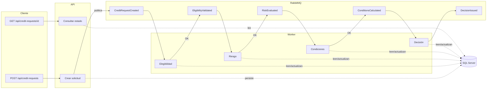

# Sistema de solicitudes de crédito

Backend para que una entidad financiera gestione solicitudes de crédito. El procesamiento **no es inmediato**: depende de varias validaciones y evaluaciones que pueden fallar o demorar.
El sistema permite **crear**: una solicitud, **consultar su estado**: en cualquier momento y **reejecutar**: un paso fallido, con pasos asincrónicos y desacoplados.

---

## Introducción y objetivo

El objetivo es un backend que implemente un **proceso de negocio compuesto**, con:

- Coordinación de múltiples pasos (registro → elegibilidad → riesgo → condiciones → decisión).
- Manejo de fallos parciales (rechazos de negocio y fallos técnicos).
- Procesamiento asincrónico mediante cola de mensajes.
- Comunicación desacoplada por eventos.
- Consistencia del estado de cada solicitud.

La API mínima expone: **crear solicitud**: (POST, 202 Accepted) y **consultar estado**: (GET, 200/404), más **completar**: (cuando el cliente paga) y **reejecutar**: (cuando un paso falló).

---

## Cómo se modela el proceso (5 pasos y estados)

### Los 5 pasos lógicos

1. **Registrar la solicitud**: — Se persiste con estado inicial y se dispara el flujo.
2. **Validar elegibilidad**: — El cliente cumple criterios básicos para el crédito.
3. **Evaluar riesgo**: — Evaluación crediticia (scoring, historial, etc.).
4. **Calcular condiciones**: — Tasa, plazo, cuota y monto total del préstamo.
5. **Emitir decisión final**: — Aprobación (o rechazo) del crédito.

Cada paso puede ejecutarse de forma asincrónica, puede fallar y actualiza el estado de la solicitud. El proceso **no es transaccional**: de punta a punta: cada paso persiste su resultado y el siguiente se dispara por evento.

### Estados de la solicitud


**Created**: Solicitud registrada; aún no se ejecutó elegibilidad.
**ValidatingEligibility**: En proceso de validación de elegibilidad.
**EligibilityRejected**: Rechazado por regla de negocio en elegibilidad (no cumple criterios).
**EvaluatingRisk**: Elegibilidad OK; en evaluación de riesgo.
**RiskEvaluated**: Riesgo evaluado; pasa a cálculo de condiciones.
**CalculatingConditions**: En cálculo de condiciones del crédito.
**ConditionsCalculated**: Condiciones calculadas; pasa a decisión final.
**Approved**: **Aprobado**: el crédito está listo para que le entreguen el dinero al cliente (aplica para el préstamo).
**Rejected**: Rechazado en riesgo u otra etapa de negocio.
**Failed**: Fallo técnico en algún paso (tras agotar reintentos); queda registrado qué paso falló.
**Rerun**: En reejecución (transitorio) desde un paso que falló.
**Aprobado**: listo para desembolso.
**Completado**: el cliente pagó su crédito (ciclo cerrado).

Las transiciones válidas se validan con una máquina de estados (Stateless) en el dominio.

---

## Cómo se coordinan los pasos (eventos y choreografía)

La coordinación es por **choreografía**: no hay orquestador central. Cada paso es un **consumer**: que reacciona a un evento, ejecuta su lógica y publica el siguiente evento (o actualiza estado y termina).

### Eventos que se publican

CreditRequestCreated**: Tras crear la solicitud (POST).
EligibilityValidated**: Cuando elegibilidad aprueba.
RiskEvaluated**: Tras evaluar riesgo.
ConditionsCalculated**: Tras calcular condiciones.
DecisionIssued**: Decisión final (Aprobado).
StepFailed**: Cuando un paso falla técnicamente (tras reintentos).

El broker es **RabbitMQ**; MassTransit configura las colas y los consumers por evento. Si un paso rechaza (negocio) o falla (técnico), **no**: se publica el evento siguiente y los pasos posteriores no se ejecutan.

### Diagrama de flujo



---

## Cómo se manejan errores y estados

### Rechazo (negocio) vs fallo (técnico)

**Rechazo**: un paso responde "no" por regla de negocio (ej. no elegible, riesgo rechazado). La solicitud queda en estados como **EligibilityRejected**: o **Rejected**. No se publica el evento que dispararía el siguiente paso.
**Fallo técnico**: excepción, timeout, error de servicio. Se aplican **reintentos automáticos**: (Polly, 3 intentos) sobre la llamada al servicio externo. Si tras 3 intentos sigue fallando, la solicitud pasa a **Failed**, se registra el paso que falló (`FailedStep`) y se publica **StepFailed**. No se publica el siguiente evento.

### Recuperación: reejecución manual

No hay compensación ni rollback de pasos ya ejecutados. La recuperación es **reejecutar solo el paso que falló**:

- Endpoint **POST**: `/api/credit-requests/{id}/reexecute` (solicitud en estado **Failed**).
- El sistema determina el paso fallido (`FailedStep`), actualiza el estado y **republica el evento**: que dispara ese paso. El Worker lo procesa de nuevo (con sus 3 reintentos).
- Si el paso ahora tiene éxito, el flujo continúa; si vuelve a fallar, la solicitud queda de nuevo en Failed.

---

## Mejoras para entorno productivo

- **Seguridad**: JWT con secret en variable de entorno; HTTPS obligatorio; security headers; sin credenciales en appsettings.
- **Resiliencia**: Políticas de retry y timeout configurables.

---

## Backlog / Tareas

Resumen del plan de desarrollo (épicas y tareas principales) con las que se construyó el proyecto:

| Épica | Tareas principales |
|-------|---------------------|
| **1. Setup** | Solución .NET 8, proyectos (Domain, Application, Infrastructure, Api, Worker), referencias entre proyectos, .gitignore, .editorconfig. |
| **2. Domain** | Estados (`CreditRequestStatus`), entidad `CreditRequest`, value objects, eventos de dominio, máquina de estados (Stateless), `ICreditRequestRepository`. |
| **3. Application** | CQRS con MediatR (comandos y queries), FluentValidation, pipeline behaviors (validación, logging), `IEventBus`, DTOs. |
| **4. Infrastructure** | EF Core + SQL Server (DbContext, migraciones, repositorio), MassTransit + RabbitMQ (IEventBus), servicios simulados (elegibilidad, riesgo, condiciones). |
| **5. API** | Endpoints POST (crear), GET (consultar), POST complete, POST reexecute; Serilog, Swagger, JWT, HealthChecks. |
| **6. Worker** | Consumers MassTransit por evento (CreditRequestCreated → EligibilityValidated → … → DecisionIssued); Polly (retry 3x); historial y FailedStep. |
| **7. Testing** | Tests unitarios (Domain: state machine, entidad; Application: handlers, validators); tests de integración API (POST/GET, flujos). |
| **8. Seguridad** | Autenticación JWT, endpoints protegidos, documentación en Swagger y README. |
| **9. Docker** | Dockerfile.api, Dockerfile.worker, docker-compose (api, worker, sqlserver, rabbitmq), .env, documentación de ejecución. |
| **10. CI/CD** | Pipeline de build y tests (push/PR). |
| **11. Documentación** | README: proceso, coordinación, errores/estados, mejoras, instrucciones de ejecución. |
| **12. Reglas de negocio** | Estado Completed, una solicitud en proceso por cliente, monto obligatorio y tope configurable, reejecución desde paso fallido. |

El detalle completo de issues y checklists está en la documentación de diseño del proyecto (p. ej. `plan-de-desarrollo.md` en la carpeta Censys).

---

## Instrucciones para ejecutar

### Opción recomendada: Docker (todo junto)

La forma más simple de ejecutar el sistema completo (API, Worker, SQL Server, RabbitMQ) es con Docker Compose:

1. **Crear el archivo de entorno** (solo la primera vez):
   ```bash
   # Windows (CMD o PowerShell)
   copy env.example .env

   # Linux / macOS
   cp env.example .env
   ```
   Edita `.env` y ajusta `MSSQL_SA_PASSWORD` y la contraseña dentro de `ConnectionStrings__DefaultConnection` (debe ser la misma). No subas `.env` al repositorio (está en .gitignore).

2. **Levantar el stack:**
   ```bash
   docker compose up --build
   ```

3. **URLs:**
   - API: http://localhost:8080
   - Swagger: http://localhost:8080/swagger
   - RabbitMQ Management: http://localhost:15672 (usuario **credit**, contraseña **credit**).
   - SQL Server: `localhost,1433` (usuario `sa`, contraseña la de `MSSQL_SA_PASSWORD` en `.env`).

La API aplica las migraciones de EF Core al arrancar. Si no podés entrar a RabbitMQ (login inválido), el usuario se crea solo con base vacía; entonces:
   ```bash
   docker compose down -v
   docker compose up --build
   ```
   y probá de nuevo con **credit**: / **credit**.

Si algún contenedor usa los puertos 8080, 5672, 15672 o 1433, detenelo antes de `docker compose up`.

### Opción desarrollo local (dotnet run)

Para **desarrollar y depurar**: (puntos de ruptura, hot reload), podés ejecutar la API y el Worker en tu máquina y apuntarlos a SQL Server y RabbitMQ (en Docker o locales):

- Requisitos: .NET 8, SQL Server (LocalDB o instancia), RabbitMQ. Configuración en `CreditSystem.Api/appsettings.json` y `CreditSystem.Worker/appsettings.json`.

**Terminal 1 – API:**
```bash
dotnet run --project CreditSystem.Api
```

**Terminal 2 – Worker:**
```bash
dotnet run --project CreditSystem.Worker
```

La API escucha en el puerto configurado (p. ej. https://localhost:5001). Swagger en `/swagger`.

### Ejecutar tests

```bash
# Todos los tests
dotnet test

# Solo tests unitarios (Domain + Application)
dotnet test --filter "FullyQualifiedName~CreditSystem.Domain.Tests|FullyQualifiedName~CreditSystem.Application.Tests"

# Solo tests de integración de la API
dotnet test CreditSystem.Api.IntegrationTests
```

---

## Autenticación

Todos los endpoints (crear solicitud, consultar, completar, reejecutar) requieren **JWT**: en el header:

```
Authorization: Bearer <token>
```

### Cómo obtener el token

1. **POST**: `/api/auth/token` con cuerpo:
   ```json
   {
     "clientId": "credit",
     "clientSecret": "credit"
   }
   ```
2. La respuesta trae `accessToken` y `expiresIn` (segundos). Usá el token en el header en las demás peticiones.
3. En Swagger: ejecutá **POST /api/auth/token**, copiá el `accessToken`, clic en **Authorize**, pegá el token y confirmá.

### Configuración JWT (appsettings, sección `Jwt`)

| Clave | Descripción |
|-------|-------------|
| `Secret` | Clave de firma (mín. 32 caracteres). En producción usar variable de entorno.
| `Issuer` | Emisor del token.
| `Audience` | Audiencia del token.
| `ExpirationMinutes` | Validez en minutos.
| `ClientId` / `ClientSecret` | Credenciales para obtener token (por defecto `credit` / `credit`).

En producción se recomienda integrar con un IdP (Keycloak, etc.) y obtener el token desde allí.
